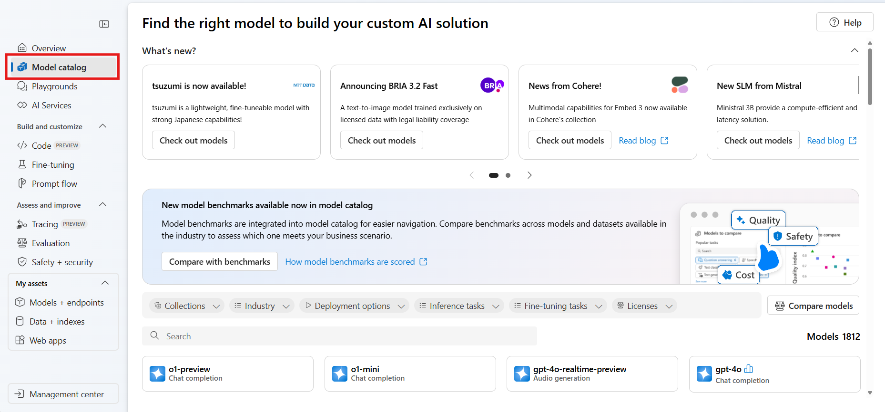
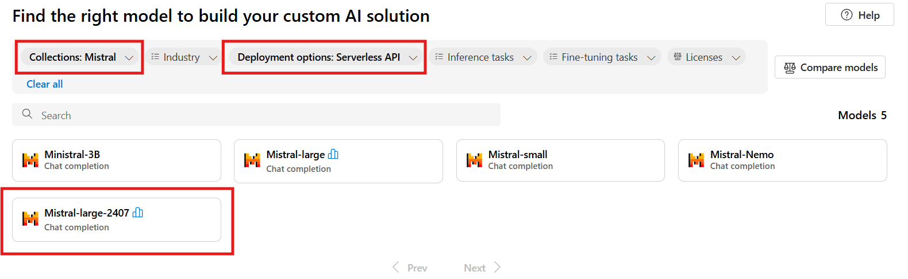
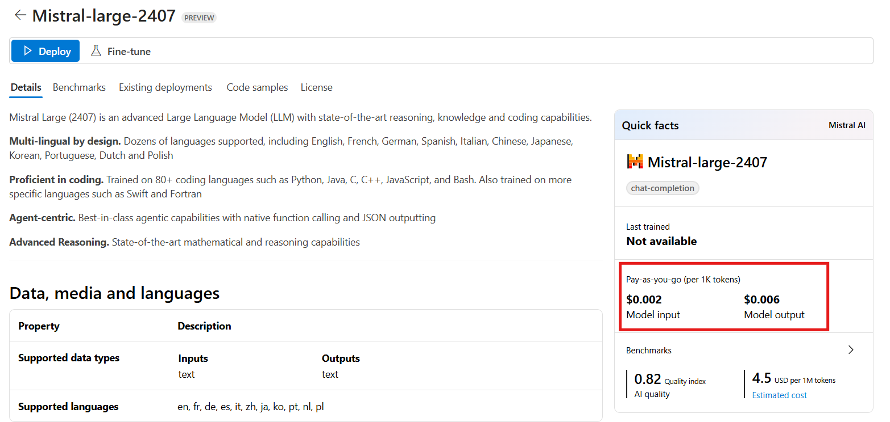

# MAAS 15 Minute Demo

## Introduction to the demo document

There are three parts:

- Part 1: Setting up demo resources
- Part 2: Deploying models as a service
- Part 3: Introduction to the Azure AI Model Inference SDK

## Demo Goal

The goal is to showcase the variety of models accessible through Azure AI Studio, emphasize their deployment simplicity, and the developer's flexibility to select different models according to requirements without code changes using the Azure AI Model Inference SDKs.

## Introduction to Models as a Service

Navigating the Model Catalog in Azure AI Studio, you'll find options to filter for Serverless and Managed Compute deployments. Deploying Managed Computers demands more resources and isn't as simple as implementing Serverless Models. This demo will concentrate on the pay-as-you-go approach for Serverless deployments.

## Considerations

- Reproducible. Models are generally available.
- Model availability
  - To keep simple, two models Mistral and Phi 3
    - Requires two Hubs
      - East US for Mistral
      - Sweden Central for Phi
- Minimising costs. The models are pay-as-you-go and cost fractions of cents to use. If you decide to use your Visual Studio linked account then you will need to connect your Credit Card but there are considerably more models available that you’ll be able to successfully deploy and will consume Azure credits. Note, you can’t remove your credit card once enabled.
- While setting up AI Studio model resources is quick, it generally takes a few minutes to complete. Therefore, it's advisable to set up the demo resources in advance and then explain their setup process during the demonstration.

## Azure AI Studio Units of Organisation

Azure AI studio allows you to organise the models you deploy to make them easier to manage. The units of deployment are Hubs, Projects, and Deployments. You deploy Hubs by region, projects are deployed by hub, and models are deployed by project.

## What subscription to use

You should be able to use your Microsoft corporate subscription, and your Microsoft linked personal Visual Studio subscription, and you will find different combinations of models available depending on the subscription you use. For this demo, it’s assumed you’ll be using your Microsoft Corporate subscription.

## Part 1: Setting up demo resources

## Deploy the Mistral and Phi models

Follow these steps to pre-deploy the models for the demo.

### Model Availability

Model availability is region dependent, so you will need to create multiple hubs based on the models you require. For the demo, create two Azure AI Studio hubs. One in East US for the Mistral model, and the other in Sweden Central for the Phi 3 model.

### Create two Azure AI Hubs

1. From browser, navigate to <https://ai.azure.com>
2. Select **All Hubs**, then add a **New Hub**
3. Name your hub, be sure to include the location to make it easier to find (eg east-us)
4. Create or reuse existing resource group
5. Set the location to **East US**
6. Create or reuse an existing Azure AI Service
7. **Skip** connecting to Azure AI Search
8. Select **Next**
9. Select **Create**. It takes a couple of minutes to create the hub.
10. **Repeat** the process to create a hub in Sweden Central to deploy a Phi 3.

    

## Create Projects

You’ll need to create a new project for both the hubs.

### Create a project in East US

1. **Select** the hub you create in **East US**
2. **Name** your project **ai-tour-fy25-mistral.**
3. Select **create**

### Add a model

1. **Select** the Model Catalog from the sidebar menu

    

### Set the following filters

1. Select **Serverless**, and **Mistral**

    

2. Select **Mistral-large-2407**
3. **Review** the model card
4. Select **Deploy**
5. **Acknowledge** Microsoft Purchase policy
    1. This will take a couple of minutes
6. **Don’t** change the deployment name
7. Select **Deploy**
    1. This will take a couple of minutes to deploy.

    

8. **Wait** until provisioning state changes to **Succeeded**

### Create a Phi model deployment in Sweden

Repeat the process to create a project in the Central-Sweden hub

1. Name the project **ai-tour-fy25-phi-3.**
2. Select **Create a project.**
3. **Select** the **Model Catalog** from the sidebar menu.
4. Set the following **filters** to **Serverless API**, and **Microsoft**
5. Select **Phi-3-small-8k-instruct**.
6. **Review** the model card.
7. Select **Deploy**.
8. Select **Serverless API with Azure AO Content Safety**
9. **Don’t** change the deployment name
10. Select Deploy. The model will take a couple of minutes to deploy.

## Part 2: Deploying models as a service

With the demo resources in place, follow these steps:

This will take between 5 and 10 minutes, take time to discuss and highlight getting started resources as you go.

### Hubs

1. **Show** how to **create a Hub** – but in the interests of time, **don’t** create.
2. **Select** your **Sweden Central hub**

### Projects

1. **Select All Projects** from the lefthand menu bar.
2. Highlight the **existing project**
3. **Show** how to **create a new project** – but in the interests of time, don’t create.
4. **Select** the **existing project** in the Sweden Central Hub.

### Model Catalog

1. **Select** Model Catalog from the **lefthand menu bar.**
2. Show setting **model filters** – in this case, select **Serverless API** and **Microsoft**. This will highlight the **Phi** model family.
3. Select one of the models, **discuss the model card**, highlight the resources, link to the resources to show the getting started samples.
4. Select Deploy, discuss, but in the interests of time, **cancel** the deployment.

### Deployments

1. Select **Deployments** from the lefthand menu bar
2. Select the existing model

### Playground

The playground allows people to explore generative AI using the newly deployed model. This is not a prompt engineering session, so suggest keeping the demo short enough to highlight there is a playground experience.

1. Select **Open in Playground**
2. Discuss that you can add your own data
3. Discuss that you can set the System message
4. Start chatting with the model with your favourite prompts.

## Part 3: Introduction to the Azure AI Model Inference SDK

By design, this demo is simple and will take 5 minutes max.

The Azure AI Model Inference SDK simplifies integrating AI models into applications. It supports Python, JavaScript, and C#/.NET, handles authentication and retries, and offers uniform access to various models. Available for serverless and managed endpoints, it ensures secure and versatile AI integration.

This demonstration is straightforward. It shows that changing models can be done without modifying the code.

Follow these steps

1. You will need the endpoint and keys for both the Phi3 and Mistral models you deployed. You can get this information from your project’s deployments card.
2. Open the [**ai-tour-maas-demo-1**](https://github.com/gloveboxes/ai-tour-maas-demo-1) repo in Codespaces.
3. Follow the [demo notes](inference-demo.md).
