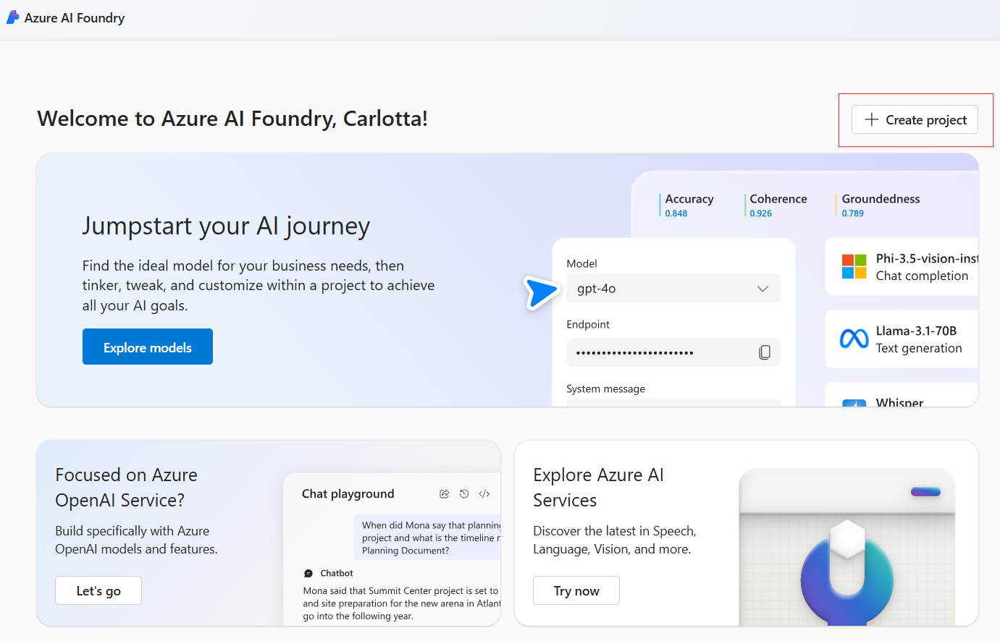

# MAAS 15 Minute Demo

## Introduction to the Demo Document

There are three parts to the demo.

- [Part 1: Setting up demo resources](#part-1-setting-up-demo-resources)
- [Part 2: Deploying models as a service](#part-2-deploying-models-as-a-service)
- [Part 3: Introduction to the Azure AI Model Inference SDK](#part-3-introduction-to-the-azure-ai-model-inference-sdk)

## Demo Goal

The goal is to showcase the variety of models accessible through Azure AI Foundry, emphasize their deployment simplicity, and the developer's flexibility to select different models according to requirements without code changes using the Azure AI Model Inference SDKs.

## Terms Used

### Azure AI Foundry

Azure AI Foundry is a platform that enables developers to build, deploy, and manage AI solutions. It provides a range of pre-trained models that can be deployed as a service, as well as tools for training custom models. Azure AI Foundry is accessible either via a UI-based experience through a [web portal](https://ai.azure.com) or a unified SDK that enables a code-first approach.

### Azure AI Foundry Models as a Service

Azure AI Foundry Models as a Service (MaaS) are pre-trained models that can be deployed as a service. They are accessible via REST APIs and SDKs and can be used for a variety of tasks, including text generation, text completion, and text classification.

### Serverless Models

Serverless models are deployed on-demand and are cost-effective. They are ideal for low to moderate usage scenarios. The models are deployed as a service and can be accessed via REST APIs and SDKs. This demo uses serverless models.

### Managed Compute

Managed compute models are deployed on dedicated resources and are ideal for high-usage scenarios. They are more expensive than serverless models but offer better performance and scalability.

### AI Foundry Hubs and Projects

Azure AI Foundry Hubs are the units of organization for models. They are deployed by region, and you can have multiple hubs in a region. The models are deployed by project, and projects are deployed by hub.

### Phi3

The [Phi-3 model](https://techcommunity.microsoft.com/t5/ai-azure-ai-services-blog/discover-the-new-multi-lingual-high-quality-phi-3-5-slms/ba-p/4225280) collection is the Microsoft's family of Small Language Models (SLMs). They are designed to be highly capable and cost-effective, outperforming models of similar and larger sizes across various benchmarks in language, reasoning, coding, and math.

### Mistral

Mistral is a large language model available from [Mistral AI](https://mistral.ai/). It is a powerful model that can be used for a variety of tasks, including text generation, text completion, and text classification and is available in Azure AI Foundry.

## Considerations

- Reproducible. Models selected for the demo should be generally available for your subscription.
- Model availability
  - To keep simple, two models Mistral and Phi 3
    - Requires one Hub in East US 2, to accomodate model's availability
- Minimizing costs. The models are pay-as-you-go and cost fractions of cents to use. If you decide to use your Visual Studio linked account then you will need to connect your Credit Card but there are considerably more models available that you’ll be able to successfully deploy and will consume Azure credits. Note, you can’t remove your credit card once enabled.
- While setting up AI Foundry model resources is quick, it generally takes a few minutes to complete. Therefore, it's advisable to set up the demo resources in advance and then explain their setup process during the demonstration.

## What subscription to use

You should be able to use your Microsoft corporate subscription, and your Microsoft linked personal Visual Studio subscription, and you will find different combinations of models available depending on the subscription you use. For this demo, it’s assumed you’ll be using your Microsoft Corporate subscription.

## Part 1: Setting up demo resources

### Deploy the Mistral and Phi models

Follow these steps to pre-deploy the models for the demo.

### Create an Azure AI Project

1. Navigate to [Azure AI Foundry Portal](https://ai.azure.com).
2. Select **Create Project**, to open the project configuration window.
3. Name your project and click on the **Customize** button to complete the configuration.
4. Create or reuse an existing resource group.
5. Set the location to **East US 2**.
6. Create or reuse an existing Azure AI Hub.
7. Create or reuse an existing Azure AI Service.
8. **Skip** connecting to Azure AI Search.
9. Select **Next**.
10. Select **Create**. It takes a couple of minutes to create the project and the hub.

    

#### Add a model

1. **Select** the Model Catalog from the sidebar menu

    

#### Set the following filters

1. Select **Serverless**, and **Mistral**.

    

2. Select **Mistral-large-2407**.
3. **Review** the model card.
4. Select **Deploy**.
5. **Acknowledge** Microsoft Purchase policy.
    1. This will take a couple of minutes.
6. **Don’t** change the deployment name.
7. Select **Deploy**.
    1. This will take a couple of minutes to deploy.

    

8. **Wait** until provisioning state changes to **Succeeded**.

#### Create a Phi Model Deployment 

1. Within your existing project, **select** the **Model Catalog** from the sidebar menu.
2. Set the following **filters** to **Serverless API**, and **Microsoft**.
3. Select **Phi-3-small-8k-instruct**.
4. **Review** the model card.
5. Select **Deploy**.
6. Select **Serverless API with Azure AO Content Safety**.
7. **Don’t** change the deployment name.
8. Select Deploy. The model will take a couple of minutes to deploy.

## Part 2: Deploying Models as a Service

With the demo resources in place, follow these steps:

This will take between 5 and 10 minutes, take time to discuss and highlight getting started resources as you go.

### Projects

1. **View All Projects** from the top section in the homepage.
2. Highlight the **existing project**.
3. **Show** how to **create a new project** – but in the interests of time, don’t create.
4. **Select** the **existing project** hosted in your hub.

### Model Catalog

1. **Select** Model Catalog from the **left-hand menu bar**.
2. Show setting **model filters** – in this case, select **Serverless API** and **Microsoft**. This will highlight the **Phi** model family.
3. Select one of the models, **discuss the model card**, highlight the resources, link to the resources to show the getting started samples.
4. Select Deploy, discuss, but in the interests of time, **cancel** the deployment.

### Deployments

1. Select **Models + endpoints** from the left-hand menu bar.
2. Select the existing model.

### Playground

The playground allows people to explore generative AI using the newly deployed model. This is not a prompt engineering session, so suggest keeping the demo short enough to highlight there is a playground experience.

1. Select **Open in Playground**.
2. Discuss that you can add your own data.
3. Discuss that you can set the System message.
4. Start chatting with the model with your favorite prompts.

## Part 3: Introduction to the Azure AI Model Inference SDK

By design, this demo is simple and will take 2 or so minutes max.

The Azure AI Model Inference SDK simplifies integrating AI models into applications. It supports Python, JavaScript, and C#/.NET, handles authentication and retries, and offers uniform access to various models. Available for serverless and managed endpoints, it ensures secure and versatile AI integration.

### Demo objective

This demo showcases how to use the PHI and MISTRAL APIs with the Azure AI Inference SDK, allowing you to switch between models without changing the code.

### GitHub Codespaces

You can run this template virtually by using GitHub Codespaces. The button will open a web-based VS Code instance in your browser:

1. Open the template (this may take several minutes to build the Codespace):

    [](https://codespaces.new/gloveboxes/ai-tour-maas-demo-1)

### VS Code Dev Containers

A related option is VS Code Dev Containers, which will open the project in your local VS Code using the [Dev Containers extension](https://marketplace.visualstudio.com/items?itemName=ms-vscode-remote.remote-containers):

1. Start Docker Desktop (install it if not already installed)
2. Open the project:

    [](https://vscode.dev/redirect?url=vscode://ms-vscode-remote.remote-containers/cloneInVolume?url=https://github.com/gloveboxes/ai-tour-maas-demo-1)

### Demo set up

You will need the endpoint and keys for the Phi3 and Mistral models you deployed. This information can be found on the deployment cards for each project.

Set these environment variables before running the sample.

1. Rename the `.env.sample` file to `.env`.
2. Add the following values to the `.env` file:

    ```bash
    PHI_ENDPOINT=<your_PHI_endpoint>
    PHI_KEY=<your_PHI_key>
    MISTRAL_ENDPOINT=<your_MISTRAL_endpoint>
    MISTRAL_KEY=<your_MISTRAL_key>
    ```

### Demo hints

This demo is best delivered in debug mode.

Follow these steps:

1. The project is set up to run in GitHub Codespaces. From [ai-tour-maas-demo-1](https://github.com/gloveboxes/ai-tour-maas-demo-1), select **<> Code** and then **Open with Codespaces**.
2. Open the `main.py` file.
3. Set the following breakpoints:
   1. At the line where the model is loaded at `client = ChatCompletionsClient(`.
   2. At `model_info = client.get_model_info()` to see the model information.
4. Press F5 to start the debug session.
5. Single step through the code to see the model info and the completion results.
6. Uncomment the `# model = Config("mistral")` line to switch models and rerun the demo.
7. Rerun the demo to see the model switch to emphasize the flexibility of the Azure AI Model Inference SDK.

Congratulations! You have successfully completed the demo.
